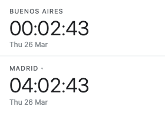
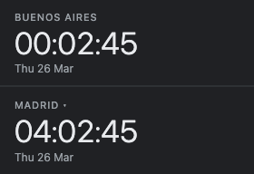

# World Clock Chrome Extension

A Chrome extension that displays your local time alongside a second timezone of your choosing.

## Screenshots

| Light | Dark |
|-------|------|
|  |  |

## Features

- Shows local time with automatic timezone label
- Shows a configurable second timezone (choose from 40 major cities)
- Hover tooltip shows both times at a glance
- Updates every second
- Clean dark UI

## Installation

1. Clone this repository
2. Open `chrome://extensions` in **Google Chrome for Testing**
3. Enable **Developer mode**
4. Click **Load unpacked** and select this directory

## Development

```bash
npm install   # Install dev dependencies (Playwright for tests)
npm test      # Run Playwright tests
```

## Project Structure

```
manifest.json       # Extension manifest (MV3)
background.js       # Service worker
popup/
  popup.html        # Extension popup UI
  popup.js          # Clock rendering logic
tests/              # Playwright tests
```

## Testing

Tests use [Playwright](https://playwright.dev/) and target **Google Chrome for Testing**.

```bash
npm test
```
